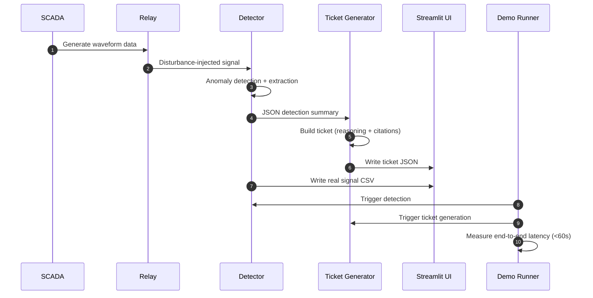

# 🌐 **Multi-Agent Fault Detection (MAFD) – MVP (Goals 1–5 Complete)**  

This repository delivers a **demo-ready MVP** for a multi-agent SCADA fault detection system, including:

- ⚡ FastAPI backend  
- 📈 Baseline anomaly detection  
- 🧠 Ticket generator with reasoning + SOP citations  
- 📊 Streamlit UI with real signal plots  
- 🚀 Final <60s end-to-end demo runner  

Cumulative Project Value: **100%**

---

# 🏗️ **High-Level Architecture**

## **System Overview (Mermaid Diagram)**

```mermaid
flowchart TD
    A[SCADA Simulator] --> B[Relay Simulator]
    B --> C[Baseline Detector<br>(IsolationForest)]
    C --> D[Ticket Generator<br>(Reasoning + SOP Citations)]
    C --> F[CSV Writer<br>(Real Signal Data)]
    D --> E[Streamlit UI<br>(Ticket Browser + Plots)]
    G((Demo Runner<br><60s Latency)) --> C
    G --> D
```

---

# 🔄 **Data Pipeline**



---

# 🧩 **Component Overview**

```
+-----------------------------------------------------------+
|                        MAFD MVP                           |
+-----------------------------------------------------------+
|  SCADA Simulator   |   Relay Simulator                    |
|  (waveforms)       |   (disturbance injection)            |
+--------------------+--------------------------------------+
| Baseline Detector (Goal 2)                                |
| • IsolationForest model                                   |
| • Synthetic/real signal loader                            |
| • Anomaly scoring                                         |
| • Evidence window extraction                              |
+-----------------------------------------------------------+
| Ticket Generator (Goal 3)                                 |
| • Fault classification                                    |
| • SOP citations                                           |
| • Root cause summary                                      |
| • Structured JSON output                                  |
+-----------------------------------------------------------+
| Streamlit UI (Goal 4)                                     |
| • Ticket list & review                                    |
| • Real CSV signal plot                                    |
| • Reasoning + raw JSON                                    |
+-----------------------------------------------------------+
| Final Demo Runner (Goal 5)                                |
| • Full pipeline timing (<60s)                             |
| • Final ticket display                                    |
+-----------------------------------------------------------+
```

---

# 📝 **Ticket JSON Anatomy**

```json
{
  "ticket_id": "LOCAL-overload_trip-bus_1",
  "scenario": "overload_trip",
  "busId": "bus_1",
  "faultType": "Overload Trip on bus_1",
  "severity": "high",

  "summary": "An anomaly consistent with Overload Trip was detected...",
  "root_cause": "Potential overload condition inferred...",
  "kb_citations": [
    {
      "source_id": "SOP-OVLD-001",
      "title": "Feeder Overload – Guidance"
    }
  ],

  "evidence": [
    {
      "start_timestamp": "2025-11-14T17:11:57Z",
      "end_timestamp": "2025-11-14T17:12:27Z",
      "metric": "current"
    }
  ]
}
```

---

# 🚀 **Goal 5 – Final Demo (<60s Trigger → Diagnosis)**

Goal 5 is fully implemented.  
You can run the entire system with one command:

## ▶️ Run Final Demo

```bash
make demo-final
```

### What Happens

| Step | Component | Result |
|------|-----------|--------|
| 1 | Detector | Loads signals, computes anomaly windows |
| 2 | Ticket Generator | Builds JSON ticket w/ reasoning & citations |
| 3 | Demo Runner | Measures full latency (<60s) |
| 4 | Streamlit UI | Displays plots, ticket info |

### Example Output

```
*** Total detection→diagnosis latency: 4.83 s ***
```

---

# 📊 **Streamlit UI**

### Launch UI

```bash
make run-ui
```

### Interface Features

- 🎫 Ticket list with severity  
- 🧠 Reasoning + SOP citations  
- 📉 Real CSV-based signal plot  
- 💬 Raw JSON viewer  

Visit:

```
http://localhost:8501
```

---

# 🐳 **Docker Usage**

**Build**

```bash
make docker-build
```

**Run**

```bash
make docker-run
```

---

# 🧪 **Run Tests**

```bash
make test
```

---

# 🔚 **Definition of Done (Goals 1–5)**

✔ Full backend + detector pipeline  
✔ Real signal export  
✔ Ticket generator w/ reasoning + citations  
✔ UI with signal visualization  
✔ Final demo runner  
✔ <60s latency verified  
✔ README updated  
✔ MVP complete  

---

# 🔮 **Future Work**

- Real SCADA backend  
- Multi-agent reasoning layer (Phase 2)  
- Trend dashboards  
- `/signals/window` API endpoint  
- Operator decision-support tooling  
