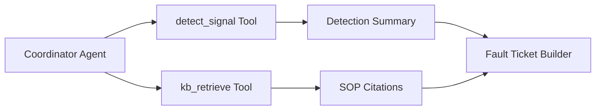

# 🧠 Agent Architecture – MAFD MVP

## Coordinator Agent Overview
The MVP uses a simplified Coordinator Agent powered by tool-calling.

### Responsibilities
- Run ML-based anomaly detection  
- Retrieve SOP guidance  
- Merge detection + RAG output into a structured ticket  

---

## Architecture Diagram


---

## Tools

### 🔧 detect_signal
Runs IsolationForest baseline anomaly detection.

### 📚 kb_retrieve
Retrieves relevant SOP markdowns via RAG.

---

## Output Schema
```json
{
  "faultType": "",
  "summary": "",
  "root_cause": "",
  "recommended_actions": [],
  "kb_citations": [],
  "evidence": []
}
```
