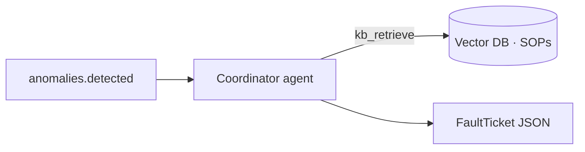

# Agent Architecture — MAFD

Authoritative design: `docs/System_Architecture.md`. This file describes the
**Coordinator agent** specifically.

## Detection-as-trigger

Detection is **not** an LLM tool. The event IsolationForest (`app/ml/fault_detector.py`)
scores each `feeder.events` row upstream and, on a fault, publishes an
`anomalies.detected` event carrying the verdict, the most-disturbed buses, and —
when the supervised classifier (`ml/fault_classifier.py`) is trained — the predicted
`fault_type` / `fault_category` / `location_km`. The coordinator is *woken* by that
event; it runs no detection of its own.

## The agent (`app/faults/`)

- **`agent.py`** — a LangGraph ReAct loop over an Azure OpenAI chat model
  (`gpt-4o-mini`-class deployment), bound to a **single tool: `kb_retrieve`**
  (SOP RAG over local `bge-small` embeddings). Client-side rate limiting
  (`InMemoryRateLimiter`), bounded `max_retries`, and a request `timeout` are set
  from `app/faults/config.py`.
- **`service.py`** — `run_fault_diagnosis(detection)`. Interprets the detection
  signature (I0/I1 → ground, I2/I1 → unbalance, deep sag → 3-phase), prefers the
  supervised classifier's label when present, retrieves SOPs, and assembles a
  **Pydantic-validated `FaultTicket`**. If Azure is not configured it returns a
  **local heuristic ticket** with no LLM call.
- **`tools.py`** — `kb_retrieve`.
- **`constants.py`** — the coordinator `SYSTEM_PROMPT`.
- **`schemas.py`** — `FaultTicket` (severity/status are `StrEnum` with tolerant
  coercion of LLM output), `DiagnoseRequest`, `TopBus`.

## Output schema

See `FaultTicket` in `app/faults/schemas.py`: `ticket_id`, `scenario`, `bus_id`,
`fault_type`, `severity`, `status`, `summary`, `root_cause`, `recommended_actions[]`,
`evidence[]`, `kb_citations[]`, `created_at`.

## Reliability

- Rate limit + retries + timeout on the LLM (see `app/faults/config.py`).
- The coordinator Kafka handler runs the (synchronous) diagnosis in a worker thread
  so the consumer loop stays responsive; failures are logged and the message is not
  committed (at-least-once redelivery).
